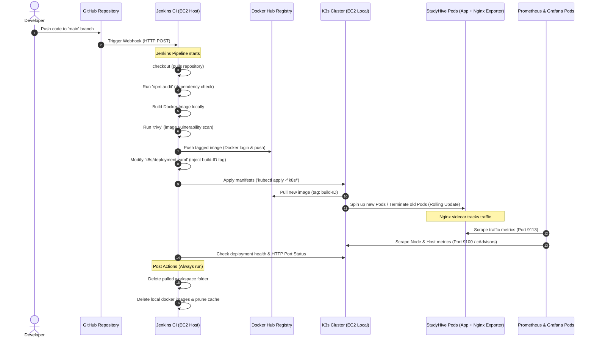

# StudyHive Cloud Architecture: End-to-End Implementation Plan

This implementation plan outlines the setup of a fully automated, secure, and cost-optimized DevSecOps CI/CD pipeline, monitoring framework, and containerized deployment infrastructure for the **StudyHive** academic portal.

By leveraging lightweight orchestration (K3s) on a single AWS EC2 instance (`c7i-flex.large`), we avoid expensive AWS managed services (such as EKS, ALB, and ECR), maintaining a cost-efficient deployment profile while implementing professional, production-grade cloud-native practices.

---

## 1. Architectural Blueprint & Workflow

The architecture uses GitHub for source control, Jenkins for automation, Docker for containerization, Trivy for security scanning, and K3s (Kubernetes) for orchestration, combined with Prometheus, Grafana, and Node Exporter for comprehensive system observability.



---

## 2. Infrastructure as Code: Terraform (`main.tf`)

This Terraform manifest provisions the AWS infrastructure. It builds a custom VPC, subnets, route tables, security group, allocates an Elastic IP, and provisions the `c7i-flex.large` instance loaded with the `user_data` bootstrap script.

> [!IMPORTANT]
> To support Grafana dashboard access, we have opened ingress port **3000** in the AWS Security Group. Port **9090** (Prometheus) remains cluster-internal and is only accessible through Grafana for enhanced security.

Create a file named `main.tf` in your infrastructure directory:

```hcl
terraform {
  required_version = ">= 1.5.0"
  required_providers {
    aws = {
      source  = "hashicorp/aws"
      version = "~> 5.0"
    }
  }
}

provider "aws" {
  region = var.aws_region
}

# --- Variables ---
variable "aws_region" {
  type        = string
  default     = "us-east-1"
  description = "Target AWS Region"
}

variable "key_name" {
  type        = string
  description = "Name of the existing EC2 Key Pair for SSH access"
}

# --- Networking ---
resource "aws_vpc" "studyhive_vpc" {
  cidr_block           = "10.0.0.0/16"
  enable_dns_hostnames = true
  enable_dns_support   = true

  tags = {
    Name = "studyhive-vpc"
  }
}

resource "aws_subnet" "public_subnet" {
  vpc_id                  = aws_vpc.studyhive_vpc.id
  cidr_block              = "10.0.1.0/24"
  availability_zone       = "${var.aws_region}a"
  map_public_ip_on_launch = true

  tags = {
    Name = "studyhive-public-subnet"
  }
}

resource "aws_internet_gateway" "igw" {
  vpc_id = aws_vpc.studyhive_vpc.id

  tags = {
    Name = "studyhive-igw"
  }
}

resource "aws_route_table" "public_rt" {
  vpc_id = aws_vpc.studyhive_vpc.id

  route {
    cidr_block = "0.0.0.0/0"
    gateway_id = aws_internet_gateway.igw.id
  }

  tags = {
    Name = "studyhive-public-rt"
  }
}

resource "aws_route_table_association" "public_rt_assoc" {
  subnet_id      = aws_subnet.public_subnet.id
  route_table_id = aws_route_table.public_rt.id
}

# --- Security Groups ---
resource "aws_security_group" "sg_studyhive" {
  name        = "studyhive-server-sg"
  description = "Security Group for StudyHive Jenkins, K3s, and Monitoring"
  vpc_id      = aws_vpc.studyhive_vpc.id

  # SSH Access
  ingress {
    description = "SSH access"
    from_port   = 22
    to_port     = 22
    protocol    = "tcp"
    cidr_blocks = ["0.0.0.0/0"] # Restrict to your public IP in production!
  }

  # Jenkins Web Console
  ingress {
    description = "Jenkins Web UI"
    from_port   = 8080
    to_port     = 8080
    protocol    = "tcp"
    cidr_blocks = ["0.0.0.0/0"] # Required for GitHub Webhook callbacks
  }

  # K3s Application Port (Exposed via Klipper ServiceLB)
  ingress {
    description = "HTTP application ingress"
    from_port   = 80
    to_port     = 80
    protocol    = "tcp"
    cidr_blocks = ["0.0.0.0/0"]
  }

  # Grafana Dashboard (Exposed via Klipper ServiceLB)
  ingress {
    description = "Grafana Web Dashboard"
    from_port   = 3000
    to_port     = 3000
    protocol    = "tcp"
    cidr_blocks = ["0.0.0.0/0"]
  }

  # Outbound Rules (Allow all internet traffic)
  egress {
    from_port   = 0
    to_port     = 0
    protocol    = "-1"
    cidr_blocks = ["0.0.0.0/0"]
  }

  tags = {
    Name = "studyhive-security-group"
  }
}

# --- AMI Data Source ---
data "aws_ami" "ubuntu" {
  most_recent = true
  filter {
    name   = "name"
    values = ["ubuntu/images/hvm-ssd/ubuntu-jammy-22.04-amd64-server-*"]
  }
  filter {
    name   = "virtualization-type"
    values = ["hvm"]
  }
  owners = ["099720109477"] # Canonical
}

# --- EC2 Instance Provisioning ---
resource "aws_instance" "studyhive_host" {
  ami           = data.aws_ami.ubuntu.id
  instance_type = "c7i-flex.large" # 2 vCPUs, 8 GB RAM - Perfect for K3s+Jenkins+Docker builds
  key_name      = var.key_name

  vpc_security_group_ids = [aws_security_group.sg_studyhive.id]
  subnet_id              = aws_subnet.public_subnet.id

  # Injecting the bootstrap shell script
  user_data = file("${path.module}/bootstrap.sh")

  root_block_device {
    volume_size           = 30
    volume_type           = "gp3"
    delete_on_termination = true
  }

  tags = {
    Name = "StudyHive-Jenkins-K3s-Host"
  }
}

# --- Elastic IP allocation ---
resource "aws_eip" "eip_studyhive" {
  instance = aws_instance.studyhive_host.id
  domain   = "vpc"

  tags = {
    Name = "studyhive-static-ip"
  }
}

# --- Outputs ---
output "instance_public_ip" {
  value       = aws_eip.eip_studyhive.public_ip
  description = "Use this IP to access Jenkins on 8080, Grafana on 3000, and the app on 80"
}
```

---

## 3. EC2 User Bootstrap Data: `bootstrap.sh`

This script is automatically executed as `root` when the EC2 instance boots. It installs the operational ecosystem, configures user permissions, and bridges Jenkins with both K3s and the local Docker daemon.

> [!NOTE]
> We explicitly install K3s with `--disable traefik`. This prevents Traefik from claiming port **80** and port **443**, allowing the lightweight **Klipper ServiceLB** to map host port 80 directly to our application pods.

Create a file named `bootstrap.sh` in the same directory as `main.tf`:

```bash
#!/bin/bash
set -e

# Redirect script output to log file for debugging and auditing
exec > >(tee /var/log/user-data.log|logger -t user-data -s 2>/dev/console) 2>&1

echo "=================== STARTING BOOTSTRAP INITIALIZATION ==================="

# 1. Update OS Package Index
export DEBIAN_FRONTEND=noninteractive
apt-get update -y
apt-get upgrade -y

# Install common utilities
apt-get install -y curl wget git apt-transport-https gnupg lsb-release ca-certificates

# 2. Install Node.js (v22.x) & npm (using modern NodeSource structure)
echo ">>> Installing Node.js and NPM..."
mkdir -p /etc/apt/keyrings
curl -fsSL https://deb.nodesource.com/gpgkey/nodesource-repo.gpg.key | gpg --dearmor -o /etc/apt/keyrings/nodesource.gpg
echo "deb [signed-by=/etc/apt/keyrings/nodesource.gpg] https://deb.nodesource.com/node_22.x nodistro main" | tee /etc/apt/sources.list.d/nodesource.list
apt-get update -y
apt-get install -y nodejs

# 3. Install Docker CE
echo ">>> Installing Docker..."
install -m 0755 -d /etc/apt/keyrings
curl -fsSL https://download.docker.com/linux/ubuntu/gpg | gpg --dearmor -o /etc/apt/keyrings/docker.gpg
chmod a+r /etc/apt/keyrings/docker.gpg

echo \
  "deb [arch=$(dpkg --print-architecture) signed-by=/etc/apt/keyrings/docker.gpg] https://download.docker.com/linux/ubuntu \
  $(. /etc/os-release && echo "$VERSION_CODENAME") stable" | tee /etc/apt/sources.list.d/docker.list > /dev/null

apt-get update -y
apt-get install -y docker-ce docker-ce-cli containerd.io docker-buildx-plugin docker-compose-plugin

systemctl start docker
systemctl enable docker

# 4. Install Jenkins
echo ">>> Installing Jenkins (Java JDK 17)..."
apt-get install -y openjdk-17-jdk openjdk-17-jre

wget -O /usr/share/keyrings/jenkins-keyring.asc https://pkg.jenkins.io/debian-stable/jenkins.io-2023.key
echo "deb [signed-by=/usr/share/keyrings/jenkins-keyring.asc] https://pkg.jenkins.io/debian-stable binary/" | tee /etc/apt/sources.list.d/jenkins.list > /dev/null

apt-get update -y
apt-get install -y jenkins

systemctl start jenkins
systemctl enable jenkins

# 5. Install Trivy (Container Vulnerability Scanner)
echo ">>> Installing Trivy..."
wget -qO - https://aquasecurity.github.io/trivy-repo/deb/public.key | gpg --dearmor | tee /usr/share/keyrings/trivy.gpg > /dev/null
echo "deb [signed-by=/usr/share/keyrings/trivy.gpg] https://aquasecurity.github.io/trivy-repo/deb $(lsb_release -sc) main" | tee /etc/apt/sources.list.d/trivy.list
apt-get update -y
apt-get install -y trivy

# 6. Install K3s (Lightweight Kubernetes Control Plane)
echo ">>> Installing K3s..."
# Disable Traefik Ingress Controller to conserve RAM and rely on Klipper ServiceLB for static Port 80/3000 binding
curl -sfL https://get.k3s.io | INSTALL_K3S_EXEC="--disable traefik" sh -

# 7. Configure System permissions & Integrations
echo ">>> Configuring System Permissions..."

# Add Jenkins user to the docker group so it can build images without sudo
usermod -aG docker jenkins

# Configure Kubeconfig for the Jenkins user
mkdir -p /var/lib/jenkins/.kube

# Wait until K3s cluster is fully initialized and configuration file exists
until [ -f /etc/rancher/k3s/k3s.yaml ]; do
  echo "Waiting for /etc/rancher/k3s/k3s.yaml file..."
  sleep 2
done

# Copy kubeconfig to Jenkins home folder and grant owner permissions
cp /etc/rancher/k3s/k3s.yaml /var/lib/jenkins/.kube/config
chown -R jenkins:jenkins /var/lib/jenkins/.kube
chmod 600 /var/lib/jenkins/.kube/config

# Also expose kubectl to default ubuntu user for manual administration/debugging
mkdir -p /home/ubuntu/.kube
cp /etc/rancher/k3s/k3s.yaml /home/ubuntu/.kube/config
chown -R ubuntu:ubuntu /home/ubuntu/.kube
chmod 600 /home/ubuntu/.kube/config

# Restart Jenkins and Docker daemon to ensure group memberships take effect immediately
systemctl restart docker
systemctl restart jenkins

echo "=================== BOOTSTRAP INITIALIZATION COMPLETE ==================="
```

---

## 4. Application Containerization & Nginx Configuration

StudyHive is a client-side React + Vite portal using `sql.js` (WebAssembly version of SQLite) running entirely in the user's browser. Rather than installing a heavy Node.js runtime in production, we compile static assets and serve them using **Nginx**.

To enable Prometheus metrics scraping, we configure Nginx to expose `/nginx_status`.

### Nginx Configuration (`nginx.conf`)
Create this file in the root of the StudyHive repository:

```nginx
server {
    listen 80;
    server_name localhost;

    location / {
        root /usr/share/nginx/html;
        index index.html index.htm;
    }

    # Internal endpoint for Nginx stub status metrics
    location /nginx_status {
        stub_status on;
        access_log off;
        allow 127.0.0.1;
        allow 10.0.0.0/8; # Allow scraping by Prometheus/exporter pods inside K3s
        deny all;
    }
}
```

### Dockerfile (`Dockerfile`)
Create this `Dockerfile` in the root of the StudyHive repository:

```dockerfile
# ==========================================
# Stage 1: Build Phase (NodeJS Environment)
# ==========================================
FROM node:22-alpine AS builder

WORKDIR /app

# Copy dependency specifications
COPY package.json package-lock.json ./

# Clean installation of locked dependencies
RUN npm ci

# Copy all application files
COPY . .

# Compile optimized static files to /app/dist
RUN npm run build

# ==========================================
# Stage 2: Run Phase (Nginx Web Server)
# ==========================================
FROM nginx:alpine

# Clean up Nginx default HTML files
RUN rm -rf /usr/share/nginx/html/*

# Copy built files from Builder Stage
COPY --from=builder /app/dist /usr/share/nginx/html

# Copy custom Nginx configuration exposing stub_status
COPY nginx.conf /etc/nginx/conf.d/default.conf

# Expose port 80 (Internal container port)
EXPOSE 80

# Run Nginx in foreground mode
CMD ["nginx", "-g", "daemon off;"]
```

---

## 5. Kubernetes Manifests: `k8s/`

Create a folder named `k8s/` in your repository.

> [!NOTE]
> **Database Persistence Design Decision**: Because StudyHive runs **100% offline-ready** and synchronizes user authentication/metrics by serializing the SQLite database to Base64 in local browser storage (`safeStorage`), there is no server-side database. Thus, **no Persistent Volume Claim (PVC) is required** in our Kubernetes manifests. This eliminates resource-heavy file sync operations on the single EC2 node.

### Deployment (`k8s/deployment.yaml`)
To monitor Nginx traffic connections, we deploy an `nginx-prometheus-exporter` container as a **sidecar** inside the StudyHive Pod. We also annotate the Pod so Prometheus automatically discovers it.

```yaml
apiVersion: apps/v1
kind: Deployment
metadata:
  name: study-hive-deployment
  labels:
    app: study-hive
spec:
  replicas: 2
  strategy:
    type: RollingUpdate
    rollingUpdate:
      maxSurge: 1
      maxUnavailable: 0
  selector:
    matchLabels:
      app: study-hive
  template:
    metadata:
      labels:
        app: study-hive
      annotations:
        # Autodiscovery instructions for Prometheus
        prometheus.io/scrape: "true"
        prometheus.io/port: "9113"
    spec:
      containers:
      # Container 1: StudyHive frontend served by Nginx
      - name: study-hive
        image: yourdockerhubusername/study-hive:latest
        imagePullPolicy: Always
        ports:
        - containerPort: 80
          name: http
        resources:
          requests:
            memory: "64Mi"
            cpu: "50m"
          limits:
            memory: "128Mi"
            cpu: "100m"
            
      # Container 2 (Sidecar): Nginx Prometheus Exporter
      - name: nginx-exporter
        image: nginx/nginx-prometheus-exporter:0.11.0
        args:
        - -nginx.scrape-uri=http://127.0.0.1/nginx_status
        ports:
        - containerPort: 9113
          name: exporter
        resources:
          requests:
            memory: "32Mi"
            cpu: "25m"
          limits:
            memory: "64Mi"
            cpu: "50m"
```

### Service (`k8s/service.yaml`)
Using `type: LoadBalancer`, K3s's built-in **Klipper ServiceLB** captures public HTTP traffic hitting the EC2 node's port 80 and maps it straight into the Pods.

```yaml
apiVersion: v1
kind: Service
metadata:
  name: study-hive-service
spec:
  selector:
    app: study-hive
  ports:
  - protocol: TCP
    port: 80
    targetPort: 80
  type: LoadBalancer
```

---

## 6. K3s Monitoring Stack Manifest: `k8s/monitoring.yaml`

To implement full system visibility, create `k8s/monitoring.yaml`. This file establishes a `monitoring` namespace, deploys **Node Exporter** as a `DaemonSet`, provisions **Prometheus** (configured with data persistence and pod autodiscovery), and spins up **Grafana** (pre-loaded with Prometheus datasource and persistent local storage, exposed on port **3000**).

> [!TIP]
> Persistent Volume Claims are configured using the default `local-path` storage class to prevent data loss for Prometheus metrics history and Grafana settings/dashboards when pods restart.

```yaml
apiVersion: v1
kind: Namespace
metadata:
  name: monitoring
---
# --- Persistent Volume Claim for Grafana ---
apiVersion: v1
kind: PersistentVolumeClaim
metadata:
  name: grafana-pvc
  namespace: monitoring
spec:
  accessModes:
    - ReadWriteOnce
  resources:
    requests:
      storage: 1Gi
---
# --- Persistent Volume Claim for Prometheus ---
apiVersion: v1
kind: PersistentVolumeClaim
metadata:
  name: prometheus-pvc
  namespace: monitoring
spec:
  accessModes:
    - ReadWriteOnce
  resources:
    requests:
      storage: 5Gi
---
# --- Node Exporter (DaemonSet) ---
apiVersion: apps/v1
kind: DaemonSet
metadata:
  name: node-exporter
  namespace: monitoring
  labels:
    app: node-exporter
spec:
  selector:
    matchLabels:
      app: node-exporter
  template:
    metadata:
      labels:
        app: node-exporter
    spec:
      hostNetwork: true
      hostPID: true
      containers:
      - name: node-exporter
        image: prom/node-exporter:v1.6.1
        args:
        - '--path.procfs=/host/proc'
        - '--path.sysfs=/host/sys'
        - '--path.rootfs=/host/root'
        ports:
        - containerPort: 9100
          hostPort: 9100
          name: metrics
        resources:
          limits:
            memory: 50Mi
            cpu: 100m
          requests:
            memory: 30Mi
            cpu: 50m
        volumeMounts:
        - name: proc
          mountPath: /host/proc
          readOnly: true
        - name: sys
          mountPath: /host/sys
          readOnly: true
        - name: root
          mountPath: /host/root
          readOnly: true
      volumes:
      - name: proc
        hostPath:
          path: /proc
      - name: sys
        hostPath:
          path: /sys
      - name: root
        hostPath:
          path: /
---
# --- Node Exporter Service ---
apiVersion: v1
kind: Service
metadata:
  name: node-exporter
  namespace: monitoring
  labels:
    app: node-exporter
spec:
  ports:
  - name: metrics
    port: 9100
    targetPort: 9100
  selector:
    app: node-exporter
---
# --- Prometheus RBAC permissions ---
apiVersion: v1
kind: ServiceAccount
metadata:
  name: prometheus-sa
  namespace: monitoring
---
apiVersion: rbac.authorization.k8s.io/v1
kind: ClusterRole
metadata:
  name: prometheus-role
rules:
- apiGroups: [""]
  resources:
  - nodes
  - nodes/proxy
  - services
  - endpoints
  - pods
  verbs: ["get", "list", "watch"]
- apiGroups: ["extensions"]
  resources:
  - ingresses
  verbs: ["get", "list", "watch"]
- nonResourceURLs: ["/metrics"]
  verbs: ["get"]
---
apiVersion: rbac.authorization.k8s.io/v1
kind: ClusterRoleBinding
metadata:
  name: prometheus-role-binding
subjects:
- kind: ServiceAccount
  name: prometheus-sa
  namespace: monitoring
roleRef:
  kind: ClusterRole
  name: prometheus-role
  apiGroup: rbac.authorization.k8s.io
---
# --- Prometheus ConfigMap ---
apiVersion: v1
kind: ConfigMap
metadata:
  name: prometheus-config
  namespace: monitoring
data:
  prometheus.yml: |
    global:
      scrape_interval: 15s
      evaluation_interval: 15s

    scrape_configs:
      - job_name: 'prometheus'
        static_configs:
          - targets: ['localhost:9090']

      # Scrape the Node Exporter using K8s service discovery endpoint
      - job_name: 'node-exporter'
        kubernetes_sd_configs:
          - role: endpoints
        relabel_configs:
          - source_labels: [__meta_kubernetes_service_label_app]
            regex: node-exporter
            action: keep

      # Auto-scrapes pods matching annotations (like Nginx Exporter sidecar)
      - job_name: 'kubernetes-pods'
        kubernetes_sd_configs:
          - role: pod
        relabel_configs:
          - source_labels: [__meta_kubernetes_pod_annotation_prometheus_io_scrape]
            action: keep
            regex: true
          - source_labels: [__meta_kubernetes_pod_annotation_prometheus_io_path]
            action: replace
            target_label: __metrics_path__
            regex: (.+)
          - source_labels: [__address__, __meta_kubernetes_pod_annotation_prometheus_io_port]
            action: replace
            target_label: __address__
            regex: ([^:]+)(?::\d+)?;(\d+)
            replacement: $1:$2
          - action: labelmap
            regex: __meta_kubernetes_pod_label_(.+)
          - source_labels: [__meta_kubernetes_namespace]
            action: replace
            target_label: kubernetes_namespace
          - source_labels: [__meta_kubernetes_pod_name]
            action: replace
            target_label: kubernetes_pod_name
---
# --- Prometheus Deployment & Service ---
apiVersion: apps/v1
kind: Deployment
metadata:
  name: prometheus-deployment
  namespace: monitoring
spec:
  replicas: 1
  selector:
    matchLabels:
      app: prometheus
  template:
    metadata:
      labels:
        app: prometheus
    spec:
      serviceAccountName: prometheus-sa
      containers:
      - name: prometheus
        image: prom/prometheus:v2.45.0
        args:
        - "--config.file=/etc/prometheus/prometheus.yml"
        - "--storage.tsdb.path=/prometheus"
        ports:
        - containerPort: 9090
        resources:
          limits:
            memory: "512Mi"
            cpu: "250m"
          requests:
            memory: "256Mi"
            cpu: "100m"
        volumeMounts:
        - name: config-volume
          mountPath: /etc/prometheus
        - name: storage-volume
          mountPath: /prometheus
      volumes:
      - name: config-volume
        configMap:
          name: prometheus-config
      - name: storage-volume
        persistentVolumeClaim:
          claimName: prometheus-pvc
---
apiVersion: v1
kind: Service
metadata:
  name: prometheus-service
  namespace: monitoring
spec:
  selector:
    app: prometheus
  ports:
    - name: web
      protocol: TCP
      port: 9090
      targetPort: 9090
  type: ClusterIP
---
# --- Grafana Datasource Auto-Provisioning ---
apiVersion: v1
kind: ConfigMap
metadata:
  name: grafana-datasources
  namespace: monitoring
data:
  prometheus.yaml: |
    apiVersion: 1
    datasources:
    - name: Prometheus
      type: prometheus
      access: proxy
      url: http://prometheus-service.monitoring.svc.cluster.local:9090
      isDefault: true
---
# --- Grafana Deployment & Service ---
apiVersion: apps/v1
kind: Deployment
metadata:
  name: grafana-deployment
  namespace: monitoring
spec:
  replicas: 1
  selector:
    matchLabels:
      app: grafana
  template:
    metadata:
      labels:
        app: grafana
    spec:
      containers:
      - name: grafana
        image: grafana/grafana:10.0.3
        ports:
        - containerPort: 3000
        resources:
          limits:
            memory: "256Mi"
            cpu: "150m"
          requests:
            memory: "128Mi"
            cpu: "50m"
        volumeMounts:
        - name: datasource-volume
          mountPath: /etc/grafana/provisioning/datasources
        - name: storage-volume
          mountPath: /var/lib/grafana
      volumes:
      - name: datasource-volume
        configMap:
          name: grafana-datasources
      - name: storage-volume
        persistentVolumeClaim:
          claimName: grafana-pvc
---
apiVersion: v1
kind: Service
metadata:
  name: grafana-service
  namespace: monitoring
spec:
  selector:
    app: grafana
  ports:
    - name: web
      protocol: TCP
      port: 3000
      targetPort: 3000
  type: LoadBalancer
```

---

## 7. Jenkins Pipeline Configuration: `Jenkinsfile`

This Jenkins Declarative Pipeline manages the entire CI/CD lifecycle. It performs audits, runs container security checks using Trivy, pushes the image to Docker Hub, modifies the manifests, rolls out the changes on K3s, performs health checks, and **always cleans up the host storage in the post stage.**

Create a file named `Jenkinsfile` in the root of the StudyHive repository:

```groovy
pipeline {
    agent any

    environment {
        // Docker Hub settings
        DOCKER_REGISTRY = 'docker.io'
        DOCKER_CREDS_ID = 'docker-hub-credentials'
        DOCKER_IMAGE    = 'yourdockerhubusername/study-hive'
        
        // Deployment paths
        K8S_MANIFEST_DIR = 'k8s'
        APP_PORT        = '80'
    }

    stages {
        stage('Source Checkout') {
            steps {
                echo 'Checking out source code from GitHub...'
                checkout scm
            }
        }

        stage('NPM Security Audit') {
            steps {
                echo 'Auditing Node dependencies for security vulnerabilities...'
                // If package-lock.json is present, check dependencies. '|| true' ensures pipeline won't halt on low/medium dev warnings.
                sh 'npm audit || true'
            }
        }

        stage('Docker Image Build') {
            steps {
                echo "Building Docker image: ${DOCKER_IMAGE}:${BUILD_NUMBER}..."
                sh "docker build -t ${DOCKER_IMAGE}:${BUILD_NUMBER} ."
                sh "docker tag ${DOCKER_IMAGE}:${BUILD_NUMBER} ${DOCKER_IMAGE}:latest"
            }
        }

        stage('Trivy Security Scan') {
            steps {
                echo 'Scanning Docker image with Trivy...'
                // Scan the built local image. Exit code 0 means warnings won't stop execution unless desired.
                sh "trivy image --exit-code 0 --severity HIGH,CRITICAL ${DOCKER_IMAGE}:${BUILD_NUMBER}"
            }
        }

        stage('Push Image to Docker Hub') {
            steps {
                echo 'Logging in and pushing image to Docker Hub registry...'
                script {
                    withCredentials([usernamePassword(credentialsId: DOCKER_CREDS_ID, usernameVariable: 'DOCKER_USER', passwordVariable: 'DOCKER_PASS')]) {
                        sh "echo \$DOCKER_PASS | docker login -u \$DOCKER_USER --password-stdin ${DOCKER_REGISTRY}"
                        sh "docker push ${DOCKER_IMAGE}:${BUILD_NUMBER}"
                        sh "docker push ${DOCKER_IMAGE}:latest"
                    }
                }
            }
        }

        stage('Update & Deploy Manifests') {
            steps {
                echo 'Injecting build number tag into Kubernetes manifest and deploying...'
                script {
                    // Update deployment manifest dynamically using sed
                    sh "sed -i 's|image: .*study-hive:.*|image: ${DOCKER_IMAGE}:${BUILD_NUMBER}|g' ${K8S_MANIFEST_DIR}/deployment.yaml"
                    
                    // Apply manifests via kubectl
                    sh "kubectl apply -f ${K8S_MANIFEST_DIR}/deployment.yaml"
                    sh "kubectl apply -f ${K8S_MANIFEST_DIR}/service.yaml"
                }
            }
        }

        stage('Rollout Status & Health Verification') {
            steps {
                echo 'Waiting for rollout to finish and executing health checks...'
                script {
                    // Wait for deployment rollout to successfully terminate
                    sh "kubectl rollout status deployment/study-hive-deployment --timeout=120s"
                    
                    // Dynamic retry loop to wait for Klipper ServiceLB to bind the port and confirm HTTP status 200
                    sh """
                    for i in {1..10}; do
                      httpStatus=\$(curl -s -o /dev/null -w '%{http_code}' http://localhost:${APP_PORT} || true)
                      if [ "\$httpStatus" = "200" ]; then
                        echo "Health Check Success! Received HTTP status: \$httpStatus"
                        exit 0
                      fi
                      echo "Waiting for Klipper port binding... (attempt \$i/10, current status: \$httpStatus)"
                      sleep 3
                    done
                    echo "Health Check Failed! Unable to establish port 80 routing."
                    exit 1
                    """
                }
            }
        }
    }

    post {
        always {
            script {
                echo '======== POST ACTIONS: Cleaning up Workspace and Host Storage ========'
                
                // 1. Delete the checked-out repository to save space on the host
                cleanWs()
                
                // 2. Remove the specific built tag image from local docker daemon storage
                sh "docker rmi ${DOCKER_IMAGE}:${BUILD_NUMBER} || true"
                sh "docker rmi ${DOCKER_IMAGE}:latest || true"
                
                // 3. Prune dangling build layers and unused builders to prevent disk creep
                sh "docker image prune -f"
                sh "docker builder prune -f"
                
                echo '======== Cleanup completed successfully! ========'
            }
        }
        success {
            echo 'Deployment Pipeline finished with SUCCESS!'
        }
        failure {
            echo 'Deployment Pipeline finished with FAILURE. Check stage details above.'
        }
    }
}
```

---

## 8. Step-by-Step Infrastructure Deployment & Setup Guide

### Step A: Provisioning Resources with Terraform
1. Configure AWS CLI with credentials that have adequate permissions (VPC, SG, EC2, Elastic IP, and IAM rights).
2. Generate your EC2 Key Pair in AWS Console and note down its name (e.g. `my-ssh-key`).
3. Place `main.tf` and `bootstrap.sh` in an infrastructure directory on your machine.
4. Execute deployment commands:
   ```bash
   terraform init
   terraform plan -var="key_name=my-ssh-key"
   terraform apply -var="key_name=my-ssh-key" -auto-approve
   ```
5. Note the output `instance_public_ip` (e.g., `54.210.12.34`).

### Step B: Accessing and Initializing Jenkins
1. Wait 3–5 minutes for the bootstrap script to complete the installations.
2. Open your web browser and navigate to: `http://<EC2-PUBLIC-IP>:8080`.
3. SSH into the instance to retrieve the initial Jenkins Administrator Password:
   ```bash
   ssh -i "my-ssh-key.pem" ubuntu@<EC2-PUBLIC-IP>
   sudo cat /var/lib/jenkins/secrets/initialAdminPassword
   ```
4. Paste the password into the browser, choose **Install Suggested Plugins**, and create your Admin user.

### Step C: Deploy the Monitoring Stack (Prometheus, Grafana, Node Exporter)
1. Since the monitoring stack is infrastructure-level and does not change on every code commit, it is deployed manually once on the node.
2. Inside your SSH terminal session on the EC2 host, create a file `monitoring.yaml` and paste the contents from Section 6.
3. Apply the monitoring manifest to the K3s cluster:
   ```bash
   kubectl apply -f monitoring.yaml
   ```
4. Verify that all components are initialized:
   ```bash
   kubectl get pods -n monitoring
   ```

### Step D: Configure Jenkins Credentials
1. Go to **Manage Jenkins** -> **Credentials** -> **System** -> **Global credentials**.
2. Click **Add Credentials**:
   - **Kind**: Username with password
   - **ID**: `docker-hub-credentials` (matches `Jenkinsfile` variable)
   - **Username**: Your Docker Hub username
   - **Password**: Your Docker Hub access token (recommended) or password.
3. Save the credential.

### Step E: Setting Up the Pipeline Job
1. In Jenkins dashboard, click **New Item**.
2. Name it `StudyHive-Pipeline`, select **Pipeline**, and click **OK**.
3. Under **Build Triggers**, tick **GitHub hook trigger for GITScm polling**.
4. Scroll to **Pipeline**:
   - **Definition**: Pipeline script from SCM
   - **SCM**: Git
   - **Repository URL**: `https://github.com/<your-username>/<your-repo-name>.git`
   - **Branch Specifier**: `*/main`
5. Save the pipeline config.

### Step F: Configure GitHub Repository Webhook
1. Go to your GitHub repository webpage -> **Settings** -> **Webhooks**.
2. Click **Add webhook**.
3. Configure the following properties:
   - **Payload URL**: `http://<EC2-PUBLIC-IP>:8080/github-webhook/` (ensure the trailing slash `/` is present!)
   - **Content type**: `application/json`
   - **Which events**: Just the `push` event.
4. Save the webhook. GitHub will send a test ping, which should show a green checkmark.

### Step G: Test the Execution Loop & Access Dashboards
1. Make a small code change to a file and commit it.
2. Push your changes: `git push origin main`.
3. Check Jenkins; you will see a build trigger automatically, executing audits, Trivy scans, pushing to Docker Hub, applying manifests, and rolling out the updated container on port 80.
4. Access `http://<EC2-PUBLIC-IP>` in your browser to view the running, updated StudyHive website!
5. Access Grafana by navigating to `http://<EC2-PUBLIC-IP>:3000`. 
   - **Default Credentials**: `admin` / `admin` (You will be prompted to choose a new password on first login).
   - **Verify Data Source**: Navigate to Connections -> Data Sources. The `Prometheus` source will already be provisioned and verified.
   - **Create Dashboard**: Click dashboards -> import -> Import a standard Node Exporter Dashboard (e.g. ID `1860`) to visualize EC2 host CPU, RAM, Disk, and network performance in real-time.
